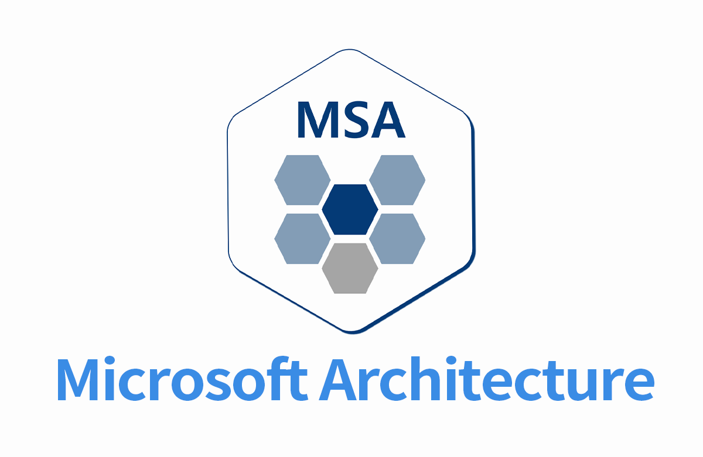

# NestJS With MSA-Gateway 

<br/>

## 🌿 Gateway Server 서버 동작 방법

```env
# .env
PORT=8800
ITEM_SERVICE_NAME=ITEM_SERVICE
ITEM_SERVICE_HOST=127.0.0.1
ITEM_SERVICE_PORT=8001
```

```bash
cd gateway-server
npm install
npm run dev
```

## 🌿 item microservice 서버 동작 방법

```env
# .env
MS_PORT=8001
MS_HOST=127.0.0.1
PORT=8101 # 개발 PORT
```

```bash
cd item-server
npm install
npm run dev
```

## 🌿 동작 확인

### Production

> gateway-server -> item-server 호출하는 방식

```
http://localhost:8800/list?name=msa
```

### Development

```
http://localhost:8101/list?name=hi
```

## 참고

- [MSA, Gateway 그리고 Nest](https://velog.io/@projaguar/MSA-Gateway-%EA%B7%B8%EB%A6%AC%EA%B3%A0-Nest#conclusion)
